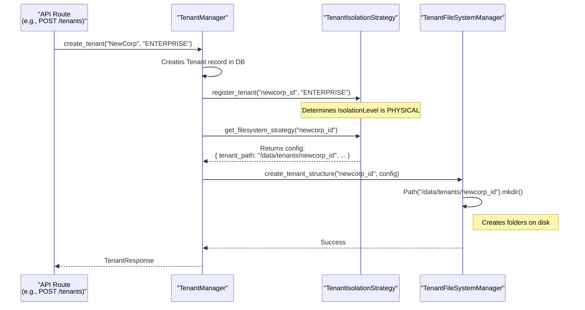

# Enterprise RAG Pipeline: Intelligent Document Assistant

## 1. Overview

This project is a sophisticated, multi-tenant Retrieval-Augmented Generation (RAG) system designed to power an intelligent enterprise support application. It allows staff to ask natural language questions and receive accurate, context-aware answers based on a private, internal corpus of corporate documents (e.g., policies, handbooks, legal documents).

The system is built with a local-first, self-hosted architecture for maximum data privacy and control, with a clear and easy path to cloud deployment. It ingests documents from specified local folders, processes them into a searchable vector database, and uses a generative LLM to provide answers, all while ensuring strict data isolation between tenants.

## 2. Core Features (MVP)

- **Multi-Tenant Architecture:** Securely supports multiple tenants with complete data isolation at the database, file system, and processing levels.
- **Automated Document Ingestion:** Monitors tenant-specific folders for new, modified, or deleted documents and automatically syncs them.
- **Delta Synchronization:** Efficiently processes only the changes in documents rather than re-processing entire files, saving time and computational resources.
- **Advanced RAG Pipeline:**
  - Utilizes state-of-the-art embedding models for high-quality semantic search.
  - Employs a sophisticated reranking step to improve the relevance of retrieved documents.
  - Generates responses using a locally-hosted Large Language Model (LLM) for privacy.
- **File Versioning:** Tracks changes to documents and embeddings, allowing for consistency and auditability.
- **Sync Reporting:** Provides a reporting interface with an interactive calendar to view the status and history of synchronization tasks.
- **Dockerized Environment:** Fully containerized with Docker for consistent development, testing, and deployment.

## 3. Architecture Overview

The system follows a modular RAG architecture:

1.  **File Ingestion & Sync:** A file system watcher monitors designated folders for each tenant. A sync process detects new, updated, and deleted files.
2.  **Document Processing Pipeline:** LlamaIndex orchestrates the processing of documents. It loads content, splits it into chunks, and generates vector embeddings using a Hugging Face `transformers` model running on a local GPU.
3.  **Metadata & Vector Storage:** A PostgreSQL/SQLite database stores file metadata, versions, and sync status. A vector store (e.g., FAISS, Chroma) stores the embeddings for efficient similarity search. All data is isolated by a `tenant_id`.
4.  **RAG Query Pipeline:**
    - An incoming query is processed.
    - A hybrid search retrieves relevant document chunks by filtering on metadata and performing a vector search.
    - A reranking model refines the search results for maximum relevance.
    - The final context is passed to a local generative LLM (via `transformers`) to synthesize an answer.
5.  **API & UI:** A FastAPI backend exposes the RAG functionality. A simple UI provides a query interface and a reporting dashboard.

## Architecture Deep Dive: Multi-Tenant Strategy

While the system is designed for multi-tenancy, it supports different levels of data isolation based on a customer's service tier. This provides a flexible architecture that can be adapted for different security and performance requirements, from cost-effective shared infrastructure to fully isolated dedicated environments.

This logic is orchestrated by the `TenantIsolationStrategy` in `src/backend/core/tenant_isolation.py`.

### Tenant Tiers (The "What")

The tiering system is a **business-level concept** that defines the service level for a tenant:

-   **`BASIC` Tier:** For customers who need core functionality on a cost-effective, shared infrastructure.
-   **`PREMIUM` Tier:** A middle ground, offering a hybrid approach with enhanced performance or security features.
-   **`ENTERPRISE` Tier:** For customers requiring the highest level of security and performance on dedicated, physically separate infrastructure.

### Isolation Levels (The "How")

The business tier maps directly to a **technical implementation strategy**, which determines how a tenant's data is actually stored:

-   **`LOGICAL` Isolation:** Used for `BASIC` tenants. Data is co-located on shared infrastructure but separated by a `tenant_id` column in database tables or a prefix in vector store collections.
-   **`PHYSICAL` Isolation:** Used for `ENTERPRISE` tenants. Data is stored in physically separate resources, such as a dedicated database instance, a separate disk volume for files, or a different vector store.

### Current Implementation vs. Production-Ready Design

You are correct that in the current development environment, all resources are shared (one database file, one `/data` directory). The project is currently configured to use only the `LOGICAL` isolation strategy for all tenants.

However, the architecture is designed so that enabling physical isolation for an `ENTERPRISE` tenant requires **no application code changes**. The logic is already in place. To make it fully operational in production, you would only need to:

1.  Provision the dedicated infrastructure (e.g., a new database or a separate mounted disk).
2.  Update the configuration in `tenant_isolation.py` to point to these new resources for `PHYSICAL`-level tenants.

### Data Flow Diagram

The following diagram illustrates how the `TenantManager` uses the `TenantIsolationStrategy` to provision resources for different tiers:



## 4. Technology Stack

- **Backend:** Python, FastAPI
- **RAG & ML:** LlamaIndex, Hugging Face `transformers`, PyTorch
- **Database:** SQLAlchemy, Alembic (for migrations), SQLite (for local dev), PostgreSQL (for prod)
- **Vector Store:** Chroma / FAISS (to be decided)
- **Deployment:** Docker, Docker Compose
- **Frontend:** React, TypeScript (as per plan)

## 5. Backend API Structure

The `src/backend/api` directory defines the web server's endpoints, acting as the primary interface between the frontend and the core backend logic.

-   **`routes/`**: This subdirectory contains the application's routes, with each file corresponding to a distinct set of functionalities:
    -   **`query.py`**: Exposes the core RAG functionality by providing endpoints to process user queries, retrieve past results, and manage query history.
    -   **`health.py`**: Offers endpoints to monitor the application's health and the status of its connected services.
    -   **`sync.py`**: Manages document synchronization, including uploading, deleting, and checking the status of documents.
    -   **`tenants.py`**: Handles tenant management, allowing for the creation, deletion, and configuration of different tenants.

## 6. Getting Started (Local Development)

1.  **Clone the repository:**
    ```bash
    git clone <repository-url>
    ```

2.  **Configure Environment:**
    - Copy the `.env.example` file to `.env`.
    - Populate the `.env` file with your local configuration details (database paths, folder paths, etc.).

3.  **Build and Run with Docker:**
    - Ensure you have Docker and Docker Compose installed, along with the NVIDIA Container Toolkit for GPU support.
    - Run the following command:
    ```bash
    docker-compose up --build
    ```

4.  **Access the Application:**
    - The API will be available at `http://localhost:8000`.
    - The UI will be available at `http://localhost:3000`.

## 7. Project Roadmap

This `README` outlines the plan for the initial MVP. We have a comprehensive roadmap for future development, including:

- **Phase 2:** Enhanced Security and Access Control
- **Phase 3:** MVP+ Core Feature Enhancements
- **Phase 4:** Advanced Application Features
- **Phase 5:** Conversation and Feedback
- **Phase 6:** Enhanced UI/UX
- **Phase 7:** Integration and Scaling

For a detailed breakdown of all current and future tasks, please see the `tasks/tasks-prd-enterprise-rag-pipeline.md` file.

🎯 Usage Examples:
# Backend (Python)
python scripts/run_backend.py --debug --port 8080
python scripts/run_backend.py --host 0.0.0.0

# Frontend (Bash)
./scripts/run_frontend.sh --port 4000
./scripts/run_frontend.sh --host 0.0.0.0 --install

# Frontend (PowerShell)
.\scripts\run_frontend.ps1 -Port 4000
.\scripts\run_frontend.ps1 -HostAddress 0.0.0.0 -Install

## 8. Data Synchronization and Embedding Generation

The platform uses a sophisticated delta synchronization process to keep tenant data up-to-date efficiently. Here's how it works:

### How it Works (The Workflow)

1.  **File Arrival**: An external process (e.g., a OneDrive or Dropbox sync client) is responsible for copying files from a customer's network into a tenant-specific staging directory: `/data/tenants/{tenant_id}/uploads/`.
2.  **Manual Trigger**: The entire sync and embedding process is kicked off **manually** by an API call. It does not run on an automatic schedule.
3.  **API Request**: An administrator or an automated script makes a `POST` request to the `/api/v1/sync` endpoint, specifying the tenant ID in the `X-Tenant-Id` header.
4.  **Delta Detection**: This API call activates the `DeltaSyncService`, which compares the files in the `/uploads` directory with the files in the internal source-of-truth `/documents` directory. By comparing file hashes, it identifies exactly which files are new, which have been updated, and which have been deleted.
5.  **Processing & Embedding Generation**:
    *   **New/Updated Files**: The service copies the files from `uploads` to `documents`. It then triggers the `DocumentIngestionPipeline`, which reads the content, splits it into chunks, and **generates vector embeddings** for each chunk. The content and embeddings are stored in the database and vector store.
    *   **Deleted Files**: The service finds the corresponding document record in the database, instructs the pipeline to delete all associated data (including embeddings), and finally removes the file from the `documents` directory.

### How to Trigger a Sync

The sync process must be triggered for each tenant individually. Use a tool like `curl` or any API client to make a `POST` request.

-   **To sync Tenant 1:**
    ```bash
    curl -X POST http://localhost:8000/api/v1/sync -H "X-Tenant-Id: tenant1"
    ```
-   **To sync Tenant 2:**
    ```bash
    curl -X POST http://localhost:8000/api/v1/sync -H "X-Tenant-Id: tenant2"
    ```

### How Often to Sync (Automation)

For automation, it is recommended to set up a **cron job** (on Linux/macOS) or a **Scheduled Task** (on Windows) to call these API endpoints at a regular interval (e.g., every hour or once per day), depending on your business requirements.

### 9. Auditing the Sync Process

To provide full visibility and traceability, the system includes a comprehensive auditing feature for the document synchronization process. Every sync run and every individual file operation is recorded in a persistent log in the database.

#### The Benefits of Auditing

*   **Complete Visibility**: See a step-by-step history of every sync run, including what files were added, updated, or deleted.
*   **Faster Debugging**: If a document fails to process, the audit log will contain the specific error message, making it easy to diagnose the root cause.
*   **Historical Record**: Maintain a permanent, verifiable ledger of all document operations for security and compliance purposes.
*   **Foundation for Monitoring**: The audit data can be used to build monitoring dashboards or automated alerts (e.g., get an email if a sync run fails).

#### How It Works

1.  **`sync_events` Table**: A new table in the database, `sync_events`, stores the audit trail.
2.  **`AuditLogger` Service**: A dedicated service is responsible for writing events to this table.
3.  **Automatic Logging**: The `DeltaSyncService` automatically calls the `AuditLogger` to record the following events:
    *   The start and end of each complete sync run.
    *   The outcome (`SUCCESS` or `FAILURE`) of every individual file operation (add, update, delete).
    *   Any error messages associated with a failure.

This creates a detailed and permanent record of all data ingestion activities within the system, turning the previously "black box" sync process into a fully transparent and debuggable one.