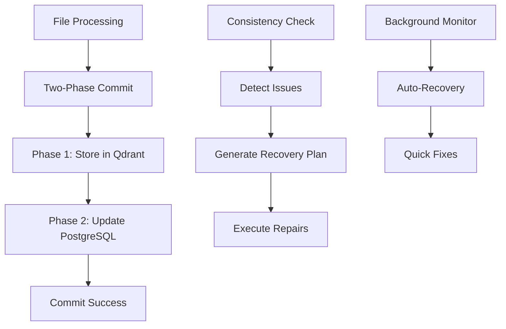

# Data Consistency Management

This document describes the comprehensive data consistency management system implemented to ensure PostgreSQL and Qdrant vector database remain synchronized, even during sync failures or system crashes.

## Overview

The RAG system stores data in two places:
- **PostgreSQL**: File metadata, sync status, embedding chunk references
- **Qdrant**: Vector embeddings for semantic search

When sync operations fail or get interrupted, these systems can become inconsistent, leading to files appearing as "synced" but missing from search results, or vice versa.

## Architecture

### Core Components

1. **TransactionalEmbeddingService**: Implements two-phase commit for embedding operations
2. **ConsistencyChecker**: Detects inconsistencies between PostgreSQL and Qdrant
3. **RecoveryService**: Automatically repairs detected inconsistencies
4. **Background Monitoring**: Continuous monitoring and auto-recovery

### Data Flow



## Two-Phase Commit Implementation

### How It Works

The transactional embedding service ensures atomicity across PostgreSQL and Qdrant:

1. **Phase 1 (Prepare)**: Store embeddings in Qdrant first
2. **Phase 2 (Commit)**: Update PostgreSQL with references
3. **Rollback**: If Phase 2 fails, remove embeddings from Qdrant

### Benefits

- **Consistency**: No partial updates between systems
- **Rollback**: Failed operations leave no orphaned data
- **Reliability**: Robust error handling and recovery

### Usage Example

```python
# Automatic usage in sync operations
chunk_records, success = await transactional_embedding_service.transactional_store_embeddings(
    file_record, chunks, embeddings
)

if success:
    print(f"Successfully stored {len(chunk_records)} chunks")
else:
    print("Transaction failed - no partial data left behind")
```

## Consistency Checking

### Types of Inconsistencies Detected

| Type | Description | Severity | Impact |
|------|-------------|----------|---------|
| **Missing Embeddings** | File marked as synced but no embeddings in Qdrant | High | File won't appear in search |
| **Orphaned Chunks** | Embedding chunks in PostgreSQL but no file record | Medium | Wasted storage space |
| **Stuck Processing** | Files stuck in processing state for >1 hour | High | Blocks other operations |
| **Qdrant/PostgreSQL Mismatch** | Different chunk counts between systems | High | Incomplete search results |
| **Orphaned Embeddings** | Embeddings in Qdrant but no PostgreSQL record | Medium | Stale search results |

### Consistency Score

The system calculates a consistency score (0-100%) based on:
- Number of inconsistencies found
- Severity of each issue
- Impact on functionality

Score interpretation:
- **95-100%**: Healthy system
- **80-94%**: Warning - minor issues
- **<80%**: Critical - requires attention

## Recovery System

### Recovery Actions

1. **Reprocess File**: Re-generate missing embeddings
2. **Cleanup Orphaned Chunks**: Remove orphaned PostgreSQL records
3. **Reset Stuck File**: Reset processing status to allow retry
4. **Re-sync File**: Fix chunk count mismatches
5. **Delete Orphaned Embeddings**: Clean up stale Qdrant data

### Recovery Plan Execution

```python
# Create recovery plan
recovery_plan = await recovery_service.create_recovery_plan(tenant_id)

# Execute with controlled concurrency
results = await recovery_service.execute_recovery_plan(
    recovery_plan, 
    max_concurrent=3
)

print(f"Completed: {results['completed_actions']}/{results['total_actions']}")
```

### Quick Fix Operations

Non-destructive operations that can be run safely:
- Reset files stuck in processing (>30 minutes)
- Reset sync operations stuck running (>1 hour)
- No data loss or modification

## API Endpoints

### Consistency Checking

```bash
# Check specific tenant
GET /api/v1/consistency/check/{tenant_id}

# Check all tenants
GET /api/v1/consistency/check-all

# Get system health summary
GET /api/v1/consistency/health-summary
```

### Recovery Operations

```bash
# Create recovery plan
POST /api/v1/consistency/recovery/plan/{tenant_id}

# Execute recovery (background)
POST /api/v1/consistency/recovery/execute/{tenant_id}

# Quick fix (immediate)
POST /api/v1/consistency/recovery/quick-fix/{tenant_id}

# Get recovery status
GET /api/v1/consistency/recovery/status
```

### Repair Recommendations

```bash
# Get actionable recommendations
POST /api/v1/consistency/repair-recommendations/{tenant_id}
```

## Background Monitoring

### Automatic Tasks

1. **Consistency Monitoring** (every 6 hours)
   - Checks all tenants for inconsistencies
   - Logs critical issues immediately
   - Provides system-wide health overview

2. **Auto-Recovery** (every 2 hours)
   - Applies quick fixes to common issues
   - Resets stuck files and operations
   - Non-destructive operations only

3. **Sync Cleanup** (every 15 minutes)
   - Cleans up stuck sync operations
   - Releases locks and resets timeouts
   - Part of existing sync management

### Configuration

Background task intervals can be configured via environment variables:

```bash
# Consistency check interval (seconds)
CONSISTENCY_CHECK_INTERVAL=21600  # 6 hours

# Auto-recovery interval (seconds)
AUTO_RECOVERY_INTERVAL=7200  # 2 hours

# Sync cleanup interval (seconds)
SYNC_CLEANUP_INTERVAL=900  # 15 minutes
```

## Monitoring and Alerts

### Health Metrics

The system provides comprehensive health metrics:

```json
{
  "system_health": {
    "overall_score": 98.5,
    "status": "healthy"
  },
  "file_statistics": {
    "total_files": 1250,
    "synced_files": 1235,
    "processing_files": 10,
    "failed_files": 5,
    "sync_rate": 98.8
  },
  "consistency_summary": {
    "tenants_with_issues": 1,
    "total_inconsistencies": 3,
    "critical_issues": 0,
    "high_issues": 2
  }
}
```

### Logging

The system logs important events:

```
INFO: Consistency check: All tenants healthy
WARN: Tenant abc123 has 2 high-priority consistency issues
ERROR: Tenant def456 has 1 critical consistency issue
INFO: Auto-recovery for tenant abc123: Reset 5 stuck files
```

## Best Practices

### Operational

1. **Monitor Health Score**: Keep consistency score above 95%
2. **Review Logs**: Check for critical consistency issues daily
3. **Schedule Maintenance**: Run manual consistency checks after system updates
4. **Test Recovery**: Periodically test recovery procedures

### Development

1. **Use Transactional Service**: Always use `TransactionalEmbeddingService` for consistency
2. **Handle Failures**: Implement proper error handling in sync operations
3. **Test Edge Cases**: Test behavior during network failures and crashes
4. **Monitor Transactions**: Track transaction success rates

### Troubleshooting

#### High Number of Stuck Files

```bash
# Quick fix to reset stuck files
curl -X POST "/api/v1/consistency/recovery/quick-fix/{tenant_id}"
```

#### Consistency Score Below 90%

```bash
# Get detailed consistency report
curl "/api/v1/consistency/check/{tenant_id}"

# Create and execute recovery plan
curl -X POST "/api/v1/consistency/recovery/execute/{tenant_id}"
```

#### Orphaned Data Issues

```bash
# Get repair recommendations
curl -X POST "/api/v1/consistency/repair-recommendations/{tenant_id}"
```

## Performance Impact

### Resource Usage

- **Consistency Checks**: ~2-5 seconds per tenant (depends on data size)
- **Recovery Operations**: ~1-3 minutes per affected file
- **Background Monitoring**: Minimal CPU/memory impact
- **Two-Phase Commit**: ~10% overhead per sync operation

### Optimization

- Background tasks run during low-usage periods
- Consistency checks use read-only queries
- Recovery operations use controlled concurrency
- Transactional overhead is minimized

## Migration and Deployment

### Enabling Data Consistency

1. **Database Migration**: Run `migrate_sync_operations.sql`
2. **Code Deployment**: Deploy updated services
3. **Background Tasks**: Restart application to enable monitoring
4. **Initial Check**: Run consistency check on all tenants

### Rollback Plan

If issues arise:

1. **Disable Background Tasks**: Stop consistency monitoring
2. **Use Legacy Service**: Fall back to original embedding service
3. **Manual Cleanup**: Use existing cleanup scripts if needed

## Security Considerations

### Data Protection

- **No Data Exposure**: Consistency checks don't access file content
- **Audit Trail**: All recovery actions are logged
- **Tenant Isolation**: Cross-tenant data access prevented
- **Safe Operations**: Quick fixes are non-destructive

### Access Control

- **Admin Only**: Consistency APIs require admin permissions
- **Rate Limiting**: Recovery operations have built-in throttling
- **Logging**: All actions are logged for audit purposes

## Future Enhancements

### Planned Features

1. **Real-time Monitoring**: WebSocket-based live consistency dashboard
2. **Predictive Recovery**: ML-based prediction of potential consistency issues
3. **Advanced Metrics**: Detailed consistency trends and analytics
4. **Custom Policies**: Configurable recovery policies per tenant

### Integration Points

- **Alerting Systems**: Integration with monitoring platforms
- **Dashboards**: Grafana/Prometheus metrics
- **Automation**: CI/CD pipeline consistency checks 