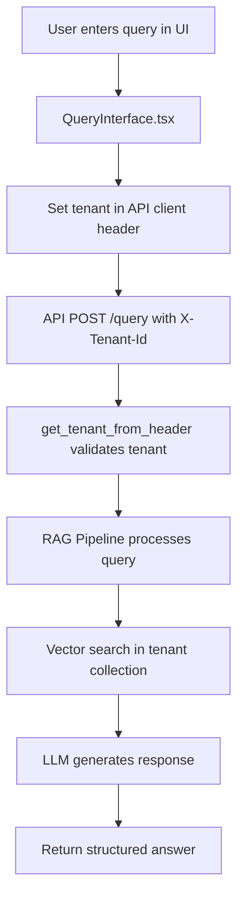
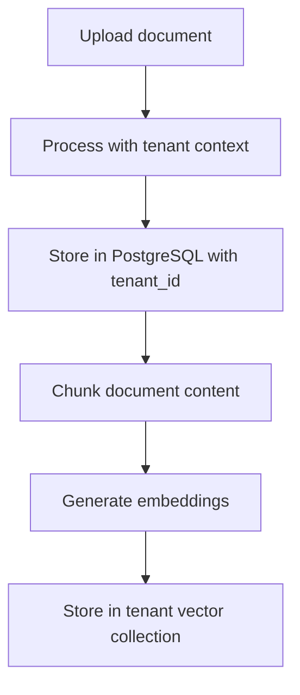

# 🔄 RAG Platform Data Flow

**Critical Reference**: Understanding this flow prevents tenant routing bugs and integration issues.

## 🎯 Query Flow (The Critical Path)



### **Frontend → Backend Handoff**
**🔥 CRITICAL**: This is where our bug happened

```typescript
// Frontend sets tenant header
useEffect(() => {
  if (tenant?.id) {
    apiClient.setTenantId(tenant.id);  // Sets X-Tenant-Id header
  }
}, [tenant]);
```

```python
# Backend extracts tenant from header
async def get_tenant_from_header(request: Request) -> str:
    tenant_id = request.headers.get("X-Tenant-Id")  # Must match exactly
```

### **Tenant Data Isolation**

```
tenant1 → tenant_tenant1_documents collection (33 docs)
tenant2 → tenant_tenant2_documents collection (4 docs)
```

**Vector Store Naming**: `tenant_{tenant_id}_documents`

## 🗄️ Document Upload Flow



## 🔍 Search Architecture

### **Query Processing Steps**
1. **Tenant Resolution**: Extract from `X-Tenant-Id` header
2. **Collection Selection**: `tenant_{tenant_id}_documents`
3. **Vector Search**: Query embeddings in tenant collection
4. **Result Filtering**: Automatic tenant isolation
5. **LLM Generation**: Generate answer from tenant's context

### **Tenant Isolation Points**
- API header validation
- Vector collection scoping
- Database row-level tenant filtering
- Result source validation

## 🚨 Common Failure Points

| Issue | Symptom | Root Cause |
|-------|---------|------------|
| "No relevant information" | UI gets empty results | Frontend not setting tenant header |
| Cross-tenant data leakage | Wrong search results | Collection routing bug |
| 500 errors on search | Server crashes | LLM service async/sync mismatch |
| Inconsistent results | Works sometimes | Race conditions in tenant context |

## ✅ Health Check Points

**Before any changes, verify:**
1. Tenant header flows from UI → API
2. Vector collections exist for active tenants
3. RAG pipeline can access tenant data
4. Search returns tenant-specific results

## 🔧 Debugging Commands

```bash
# Check tenant data
python scripts/explore_data.py

# Test specific tenant
curl -H "X-Tenant-Id: tenant1" \
     -H "Authorization: Bearer dev-api-key-123" \
     -H "Content-Type: application/json" \
     -d '{"query": "test"}' \
     http://localhost:8000/api/v1/query

# Validate system health  
python scripts/health_check.py
```

## 📋 Change Checklist

Before modifying tenant or query logic:

- [ ] Run health check
- [ ] Test with multiple tenants
- [ ] Verify header flow
- [ ] Check vector collections
- [ ] Validate isolation
- [ ] Test error cases 