# Docker Configuration & Port Mapping

## Overview

The RAG platform uses a **simplified, 3-service Docker architecture** after removing Redis and Nginx dependencies. Each service now exposes its ports **directly** to the host machine, eliminating the need for a reverse proxy.

## Architecture Diagram

```mermaid
graph TD
    A["🌐 Your Browser<br/>localhost:3000"] --> B["📦 Frontend Container<br/>rag_frontend<br/>Port 3000:3000"]
    C["🔧 API Client<br/>localhost:8000"] --> D["📦 Backend Container<br/>rag_backend<br/>Port 8000:8000"]
    E["🔍 Qdrant Client<br/>localhost:6333"] --> F["📦 Qdrant Container<br/>rag_qdrant<br/>Port 6333:6333<br/>Port 6334:6334"]
    
    B --> D
    D --> F
    
    G["🖥️ Host Machine<br/>Windows"] -.-> A
    G -.-> C  
    G -.-> E
    
    H["🐳 Docker Network<br/>rag_network"] -.-> B
    H -.-> D
    H -.-> F
```



## Port Mapping Structure

| Service | Container Port | Host Port | Access URL | Purpose |
|---------|---------------|-----------|------------|---------|
| **Frontend** | `3000` | `3000` | `http://localhost:3000` | React/Vite Dev Server |
| **Backend** | `8000` | `8000` | `http://localhost:8000` | FastAPI Application |
| **Qdrant** | `6333` | `6333` | `http://localhost:6333` | Vector DB HTTP API |
| **Qdrant** | `6334` | `6334` | `http://localhost:6334` | Vector DB gRPC API |

## Service Details

### 1. Frontend Service (Port 3000)
- **Container**: `rag_frontend`
- **Base Image**: Node.js 20 Alpine
- **Access URL**: `http://localhost:3000`
- **Features**:
  - React application with TypeScript
  - Vite development server with HMR
  - Tailwind CSS styling
  - Hot reload for development

### 2. Backend API Service (Port 8000)
- **Container**: `rag_backend`
- **Base Image**: NVIDIA PyTorch (for GPU support)
- **Access URL**: `http://localhost:8000`
- **Features**:
  - FastAPI application
  - Automatic OpenAPI documentation
  - Hot reload for development
  - Non-root user for security

### 3. Qdrant Vector Database (Ports 6333/6334)
- **Container**: `rag_qdrant`
- **Image**: `qdrant/qdrant:v1.7.4`
- **HTTP API**: `http://localhost:6333`
- **gRPC API**: `localhost:6334`
- **Features**:
  - Vector similarity search
  - HTTP REST API
  - gRPC API for high performance
  - Web dashboard

## Real Endpoint Access

### 🌐 Frontend (User Interface)
```
URL: http://localhost:3000
Purpose: Main application interface
Features: Document upload, query interface, results display
```

### 🔧 Backend API (All API Endpoints)
```
Base URL: http://localhost:8000/api/v1

Key Endpoints:
├── Health Check: /health/liveness
├── API Documentation: /docs (Swagger UI)
├── Query: /query
├── Documents: /documents
├── Tenants: /tenants
├── Sync: /sync
└── Audit: /audit
```

### 🔍 Qdrant Vector Database (Direct Access)
```
HTTP API: http://localhost:6333

Key Endpoints:
├── Collections: /collections
├── Points: /collections/{collection}/points
├── Search: /collections/{collection}/points/search
├── Dashboard: /dashboard (Qdrant Web UI)
└── Cluster Info: /cluster
```

## Architecture Comparison

### Before (With Nginx Reverse Proxy)
```
Browser → nginx:80 → routes to backend:8000
                  → routes to frontend:3000
                  → routes to qdrant:6333
```

### Now (Direct Port Mapping)
```
Browser → localhost:3000 → frontend container
API calls → localhost:8000 → backend container  
DB access → localhost:6333 → qdrant container
```

## Inter-Service Communication

### Inside Docker Network (`rag_network`)
- Frontend → Backend: `http://backend:8000/api/v1`
- Backend → Qdrant: `http://qdrant:6333`

### From Host Machine
- Frontend → Backend: `http://localhost:8000/api/v1` (via `VITE_API_BASE_URL`)
- Direct API Access: `http://localhost:8000/api/v1/*`
- Direct DB Access: `http://localhost:6333/*`

## Quick Start Commands

### Start All Services
```bash
# Build and start the complete stack
docker-compose up -d

# View logs from all services
docker-compose logs -f

# Check service status
docker-compose ps
```

### Access the Application
```bash
# Open the main application
start http://localhost:3000

# View API documentation
start http://localhost:8000/docs

# Access Qdrant dashboard
start http://localhost:6333/dashboard
```

### Individual Service Management
```bash
# Start only specific services
docker-compose up qdrant backend    # Backend development
docker-compose up frontend          # Frontend development

# Rebuild after code changes
docker-compose build --no-cache backend
docker-compose build --no-cache frontend

# View service-specific logs
docker-compose logs -f backend
docker-compose logs -f frontend
docker-compose logs -f qdrant
```

## Development Workflow

### Full Stack Development
```bash
# 1. Start all services
docker-compose up -d

# 2. Access application
open http://localhost:3000

# 3. Monitor logs
docker-compose logs -f
```

### Backend-Only Development
```bash
# 1. Start dependencies
docker-compose up qdrant -d

# 2. Start backend with live reload
docker-compose up backend

# 3. Test API directly
curl http://localhost:8000/api/v1/health/liveness
```

### Frontend-Only Development
```bash
# 1. Start backend services
docker-compose up qdrant backend -d

# 2. Start frontend with HMR
docker-compose up frontend

# 3. Access UI
open http://localhost:3000
```

## Testing Endpoints

### Health Checks
```bash
# Backend health
curl http://localhost:8000/api/v1/health/liveness

# Qdrant health  
curl http://localhost:6333/cluster

# Frontend (via browser)
open http://localhost:3000
```

### API Testing
```bash
# View API documentation
open http://localhost:8000/docs

# Test query endpoint (requires authentication)
curl -X POST http://localhost:8000/api/v1/query \
  -H "Content-Type: application/json" \
  -d '{"query": "test query", "tenant_id": "default"}'
```

### Database Access
```bash
# List collections
curl http://localhost:6333/collections

# Get collection info
curl http://localhost:6333/collections/tenant_default_documents

# Access web dashboard
open http://localhost:6333/dashboard
```

## Benefits of Direct Port Mapping

✅ **Simpler Architecture**: No reverse proxy complexity  
✅ **Easier Debugging**: Direct access to each service  
✅ **Faster Development**: No Nginx configuration to manage  
✅ **Better Visibility**: Clear port ownership per service  
✅ **Individual Testing**: Test each service independently  
✅ **Reduced Resource Usage**: Fewer containers to manage  
✅ **Cleaner Logs**: Service-specific log streams  

## Environment Configuration

### Required Environment Variables
```bash
# Qdrant connection
QDRANT_URL=http://qdrant:6333

# Frontend API configuration  
VITE_API_BASE_URL=http://localhost:8000/api/v1

# Development settings
NODE_ENV=development
RELOAD_ON_CHANGE=true
```

### Port Requirements
Ensure these ports are available on your host machine:
- **3000**: Frontend development server
- **6333**: Qdrant HTTP API  
- **6334**: Qdrant gRPC API
- **8000**: Backend FastAPI application

## Troubleshooting

### Common Issues

**Port Conflicts**:
```bash
# Check what's using the ports
netstat -an | findstr ":3000\|:6333\|:8000"

# Kill processes using required ports
# Then restart Docker services
```

**Container Won't Start**:
```bash
# Check container logs
docker-compose logs backend
docker-compose logs frontend
docker-compose logs qdrant

# Rebuild containers
docker-compose build --no-cache
```

**API Not Accessible**:
```bash
# Verify backend is running
docker-compose ps

# Check backend logs for errors
docker-compose logs backend

# Test health endpoint
curl http://localhost:8000/api/v1/health/liveness
```

**Frontend Can't Connect to Backend**:
- Verify `VITE_API_BASE_URL=http://localhost:8000/api/v1`
- Ensure backend container is running
- Check browser network tab for CORS errors

### Debugging Commands
```bash
# Enter running containers
docker exec -it rag_backend bash
docker exec -it rag_frontend sh
docker exec -it rag_qdrant sh

# Check container networking
docker network inspect rag_rag_network

# View container resource usage
docker stats

# Clean up everything
docker-compose down -v
docker system prune -f
```

## Migration from Nginx Setup

If migrating from a previous Nginx-based setup:

1. **Remove Nginx references** from docker-compose files
2. **Update frontend configuration** to use direct backend port
3. **Update API client configurations** to use `localhost:8000`
4. **Test all port mappings** after migration
5. **Update any external tools** that were using proxied URLs

The new direct port mapping approach provides better development experience and easier debugging capabilities. 