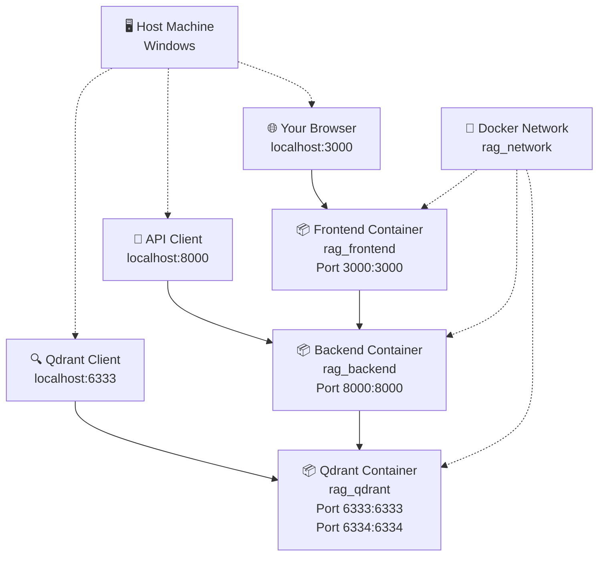

# Operations Guide

This guide provides comprehensive instructions for setting up, deploying, and managing the RAG platform environment.

---

## Docker Configuration & Deployment

This section covers the Docker setup, port mapping, and service management.

### Overview

The RAG platform uses a **simplified, 3-service Docker architecture** after removing Redis and Nginx dependencies. Each service now exposes its ports **directly** to the host machine, eliminating the need for a reverse proxy.

### Architecture Diagram



### Port Mapping Structure

| Service | Container Port | Host Port | Access URL | Purpose |
|---------|---------------|-----------|------------|---------|
| **Frontend** | `3000` | `3000` | `http://localhost:3000` | React/Vite Dev Server |
| **Backend** | `8000` | `8000` | `http://localhost:8000` | FastAPI Application |
| **Qdrant** | `6333` | `6333` | `http://localhost:6333` | Vector DB HTTP API |
| **Qdrant** | `6334` | `6334` | `http://localhost:6334` | Vector DB gRPC API |

### Service Details

#### 1. Frontend Service (Port 3000)
- **Container**: `rag_frontend`
- **Base Image**: Node.js 20 Alpine
- **Access URL**: `http://localhost:3000`
- **Features**:
  - React application with TypeScript
  - Vite development server with HMR
  - Tailwind CSS styling
  - Hot reload for development

#### 2. Backend API Service (Port 8000)
- **Container**: `rag_backend`
- **Base Image**: NVIDIA PyTorch (for GPU support)
- **Access URL**: `http://localhost:8000`
- **Features**:
  - FastAPI application
  - Automatic OpenAPI documentation
  - Hot reload for development
  - Non-root user for security

#### 3. Qdrant Vector Database (Ports 6333/6334)
- **Container**: `rag_qdrant`
- **Image**: `qdrant/qdrant:v1.7.4`
- **HTTP API**: `http://localhost:6333`
- **gRPC API**: `localhost:6334`
- **Features**:
  - Vector similarity search
  - HTTP REST API
  - gRPC API for high performance
  - Web dashboard

### Quick Start Commands

#### Start All Services
```bash
# Build and start the complete stack
docker-compose up -d

# View logs from all services
docker-compose logs -f

# Check service status
docker-compose ps
```

#### Access the Application
```bash
# Open the main application
start http://localhost:3000

# View API documentation
start http://localhost:8000/docs

# Access Qdrant dashboard
start http://localhost:6333/dashboard
```

---

## Demo Tenant Setup & Management

This section explains how to create and manage demo tenants for testing and development.

### Quick Start

#### Option 1: Default Demo Setup (Recommended)

The fastest way to create demo tenants that match your data folder structure:

```bash
# Creates tenant1, tenant2, tenant3 with API keys
python scripts/api-demo.py --setup-default
```

This command will:
- Create tenants named `tenant1`, `tenant2`, `tenant3`
- Generate API keys for each tenant
- Save API keys to `demo_tenant_keys.json`
- Set up document collections in Qdrant
- Configure 24-hour demo duration

#### Option 2: Custom Demo Setup

For custom tenant configurations:

```bash
# Custom demo tenants with specific duration
python scripts/api-demo.py --setup --demo-tenants "custom1,custom2" --duration 48

# Setup without API keys
python scripts/api-demo.py --setup --demo-tenants "tenant1,tenant2" --no-api-keys
```

### API Key Management

When creating demo tenants with API keys enabled, keys are automatically:
- Generated for each tenant
- Saved to `demo_tenant_keys.json`
- Displayed in console output
- Associated with the tenant in the database

After demo setup, use the generated keys from `demo_tenant_keys.json`.

### Common Workflows

#### Complete Demo Setup

```bash
# 1. Setup demo environment
python scripts/api-demo.py --setup-default

# 2. Verify tenants were created
python scripts/api-demo.py --list

# 3. Start backend server
docker-compose up -d

# 4. Use API keys from demo_tenant_keys.json in your frontend
```

### Troubleshooting

1.  **"Please update ADMIN_API_KEY"**: Ensure admin API key is set in environment or `.env` file.
2.  **"Tenant already exists"**: Use `--list` to see existing tenants or delete the tenant before recreating.
3.  **"Connection refused"**: Ensure backend server and Docker containers are running.
4.  **API keys not saved**: Check file permissions and console output. 