# Operations Guide

This guide provides comprehensive instructions for setting up, deploying, and managing the RAG platform environment.

---

## Docker Configuration & Deployment

This section covers the Docker setup, port mapping, and service management.

### Overview

The RAG platform uses a **simplified, 3-service Docker architecture** with PostgreSQL + pgvector for unified data storage. Each service exposes its ports **directly** to the host machine for easy access.

### Architecture Diagram

```mermaid
graph TD
    A["🌐 Your Browser<br/>localhost:3000"] --> B["📦 Frontend Container<br/>rag_frontend<br/>Port 3000:3000"]
    C["🔧 API Client<br/>localhost:8000"] --> D["📦 Backend Container<br/>rag_backend<br/>Port 8000:8000"]
    E["🗄️ DB Client<br/>localhost:5432"] --> F["📦 PostgreSQL + pgvector<br/>rag_postgres<br/>Port 5432:5432"]
    
    B --> D
    D --> F
    
    G["🖥️ Host Machine<br/>Windows/Linux"] -.-> A
    G -.-> C  
    G -.-> E
    
    H["🐳 Docker Network<br/>rag_network"] -.-> B
    H -.-> D
    H -.-> F
```



### Port Mapping Structure

| Service | Container Port | Host Port | Access URL | Purpose |
|---------|---------------|-----------|------------|---------|
| **Frontend** | `3000` | `3000` | `http://localhost:3000` | React/Vite Dev Server |
| **Backend** | `8000` | `8000` | `http://localhost:8000` | FastAPI Application |
| **PostgreSQL** | `5432` | `5432` | `localhost:5432` | Database with pgvector |

### Service Details

#### 1. Frontend Service (Port 3000)
- **Container**: `rag_frontend`
- **Base Image**: Node.js 20 Alpine
- **Access URL**: `http://localhost:3000`
- **Features**:
  - React 18 with TypeScript
  - Vite dev server with hot reload
  - Material-UI component library
  - Auto-start with `docker-compose up`

#### 2. Backend Service (Port 8000)
- **Container**: `rag_backend`
- **Base Image**: Python 3.11 with ML dependencies
- **Access URL**: `http://localhost:8000`
- **Features**:
  - FastAPI with automatic OpenAPI docs
  - Comprehensive RAG pipeline
  - Multi-tenant authentication
  - Delta sync with pgvector storage

#### 3. PostgreSQL + pgvector Service (Port 5432)
- **Container**: `rag_postgres`
- **Base Image**: `pgvector/pgvector:pg16`
- **Access**: `localhost:5432`
- **Features**:
  - PostgreSQL 16 with pgvector extension
  - Unified storage for metadata and vectors
  - ACID transactions for data consistency
  - Automatic database initialization

---

## Quick Start Deployment

### 1. Prerequisites
```bash
# Ensure Docker and Docker Compose are installed
docker --version          # Should be 24.0+
docker-compose --version   # Should be 2.20+
```

### 2. Clone and Start
```bash
git clone <repository-url>
cd rag
docker-compose up -d
```

### 3. Verify Services
```bash
# Check service status
docker-compose ps

# Expected output:
# NAME             STATUS    PORTS
# rag_backend      Up        0.0.0.0:8000->8000/tcp
# rag_frontend     Up        0.0.0.0:3000->3000/tcp  
# rag_postgres     Up        0.0.0.0:5432->5432/tcp
# rag_init         Exited(0)  # Normal after setup
```

### 4. Access Services
- **Frontend UI**: [http://localhost:3000](http://localhost:3000)
- **API Docs**: [http://localhost:8000/docs](http://localhost:8000/docs)
- **Health Check**: [http://localhost:8000/api/v1/health](http://localhost:8000/api/v1/health)

---

## Environment Configuration

### Primary Configuration (.env)
```bash
# Database Configuration
POSTGRES_HOST=postgres
POSTGRES_PORT=5432
POSTGRES_DB=rag_db_development
POSTGRES_USER=rag_user
POSTGRES_PASSWORD=your_secure_password

# API Configuration
API_HOST=0.0.0.0
API_PORT=8000
LOG_LEVEL=INFO

# ML Configuration
EMBEDDING_MODEL=sentence-transformers/all-MiniLM-L6-v2
NLTK_DATA=/tmp/nltk_data

# Security
SECRET_KEY=your_secret_key_change_in_production
ADMIN_API_KEY=your_admin_api_key

# Paths
UPLOAD_BASE_PATH=/app/data/uploads
```

### Docker Compose Override
For development customization, create `docker-compose.override.yml`:
```yaml
version: '3.8'
services:
  backend:
    volumes:
      - ./src:/app/src  # Enable hot reload
    environment:
      - LOG_LEVEL=DEBUG
  
  frontend:
    environment:
      - VITE_API_BASE_URL=http://localhost:8000
```

---

## Data Management

### File Storage Structure
```
data/
├── uploads/           # Tenant file uploads
│   ├── tenant1/
│   ├── tenant2/
│   └── admin/
├── cache/             # ML model cache
│   ├── huggingface/
│   └── transformers/
└── logs/              # Application logs
```

### Database Management
```bash
# Connect to PostgreSQL
docker exec -it rag_postgres psql -U rag_user -d rag_db_development

# View tables
\dt

# Check pgvector extension
SELECT * FROM pg_extension WHERE extname = 'vector';

# View tenants
SELECT id, name, plan_tier FROM tenants;
```

### Backup and Restore
```bash
# Backup database
docker exec rag_postgres pg_dump -U rag_user rag_db_development > backup.sql

# Restore database
docker exec -i rag_postgres psql -U rag_user rag_db_development < backup.sql
```

---

## Development Workflow

### 1. Frontend Development
```bash
# Start with hot reload
docker-compose up -d

# Or manual development
make frontend-shell
npm run dev
```

### 2. Backend Development
```bash
# View logs
docker-compose logs -f backend

# Restart after changes
docker-compose restart backend

# Manual development (if needed)
python -m uvicorn src.backend.main:app --reload --host 0.0.0.0 --port 8000
```

### 3. Database Development
```bash
# Reset database
docker-compose down
docker volume rm rag_postgres_data
docker-compose up -d

# Run migrations (if any)
docker exec rag_backend python -m alembic upgrade head
```

---

## Testing and Validation

### Demo Setup
```bash
# Create demo tenants with API keys
python scripts/workflow/setup_demo_tenants.py

# Test complete system
python scripts/test_system.py

# Test RAG queries
python demo_rag_queries.py
```

### Health Checks
```bash
# Basic health
curl http://localhost:8000/api/v1/health

# Detailed health
curl http://localhost:8000/api/v1/health/detailed

# Database connectivity
curl http://localhost:8000/api/v1/health/database
```

### Load Testing
```bash
# Simple load test
for i in {1..10}; do
  curl -H "X-API-Key: $API_KEY" http://localhost:8000/api/v1/files &
done
wait
```

---

## Production Deployment

### 1. Environment Preparation
```bash
# Create production environment file
cp .env.example .env.production

# Update values for production:
# - Use strong passwords
# - Set proper SECRET_KEY
# - Configure external database if needed
# - Set LOG_LEVEL=INFO
```

### 2. Production Build
```bash
# Build production images
docker-compose -f docker-compose.prod.yml build

# Start production services
docker-compose -f docker-compose.prod.yml up -d
```

### 3. SSL/TLS Configuration
```bash
# Using Let's Encrypt with nginx
# (Add nginx reverse proxy configuration)
```

### 4. Monitoring Setup
```bash
# View service metrics
docker stats

# Monitor logs
docker-compose logs -f --tail=100

# Database monitoring
docker exec rag_postgres psql -U rag_user -d rag_db_development -c "SELECT * FROM pg_stat_activity;"
```

---

## Troubleshooting

### Common Issues

#### Backend Won't Start
```bash
# Check logs
docker-compose logs backend

# Common fixes:
# 1. Database not ready - wait for postgres container
# 2. Port conflict - change API_PORT
# 3. Permission issues - check file permissions
```

#### Frontend Not Loading
```bash
# Check if backend is accessible
curl http://localhost:8000/api/v1/health

# Check frontend logs
docker-compose logs frontend

# Common fixes:
# 1. Backend not running
# 2. VITE_API_BASE_URL misconfigured
# 3. Port 3000 already in use
```

#### Database Connection Issues
```bash
# Check postgres container
docker-compose logs postgres

# Test connection
docker exec rag_postgres pg_isready -U rag_user

# Common fixes:
# 1. Container not started
# 2. Wrong credentials in .env
# 3. Port 5432 already in use
```

#### ML Model Loading Issues
```bash
# Check backend logs for model loading
docker-compose logs backend | grep -i "model\|embedding"

# Common fixes:
# 1. Insufficient memory (need 8GB+ RAM)
# 2. GPU drivers (if using GPU)
# 3. Model cache corruption - delete cache/transformers/
```

### Performance Issues

#### Slow Query Response
```bash
# Check database performance
docker exec rag_postgres psql -U rag_user -d rag_db_development -c "SELECT * FROM pg_stat_user_tables;"

# Check pgvector indexes
docker exec rag_postgres psql -U rag_user -d rag_db_development -c "\d+ embedding_chunks"
```

#### High Memory Usage
```bash
# Monitor container resources
docker stats

# Common solutions:
# 1. Reduce batch size in settings
# 2. Add more RAM
# 3. Optimize ML model settings
```

---

## Maintenance

### Regular Tasks
```bash
# Update containers (weekly)
docker-compose pull
docker-compose up -d

# Clean up old images (monthly)
docker image prune -f

# Backup database (daily in production)
docker exec rag_postgres pg_dump -U rag_user rag_db_development > backup_$(date +%Y%m%d).sql
```

### Monitoring
```bash
# Check disk usage
df -h

# Check container health
docker ps --format "table {{.Names}}\t{{.Status}}\t{{.Ports}}"

# Monitor logs for errors
docker-compose logs --tail=50 | grep -i error
```

---

## Support and Resources

### Documentation
- **API Reference**: `/docs/API_REFERENCE.md`
- **Architecture**: `/docs/Architecture.md`
- **RAG Tuning**: `/docs/RAG_TUNING.md`

### API Documentation
- **Interactive Docs**: [http://localhost:8000/docs](http://localhost:8000/docs)
- **OpenAPI Spec**: [http://localhost:8000/openapi.json](http://localhost:8000/openapi.json)

### Community
- **Issues**: GitHub Issues
- **Discussions**: GitHub Discussions
- **Wiki**: Project Wiki

This operations guide covers the essential aspects of deploying and managing the RAG platform with the simplified PostgreSQL + pgvector architecture.