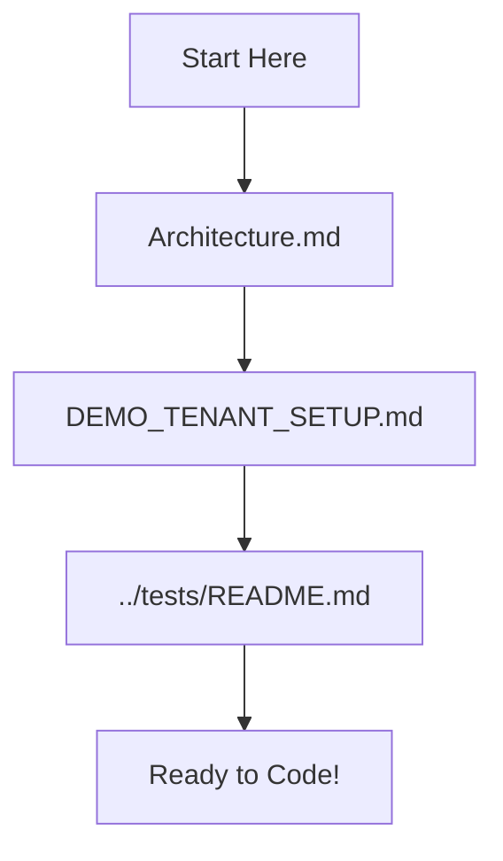
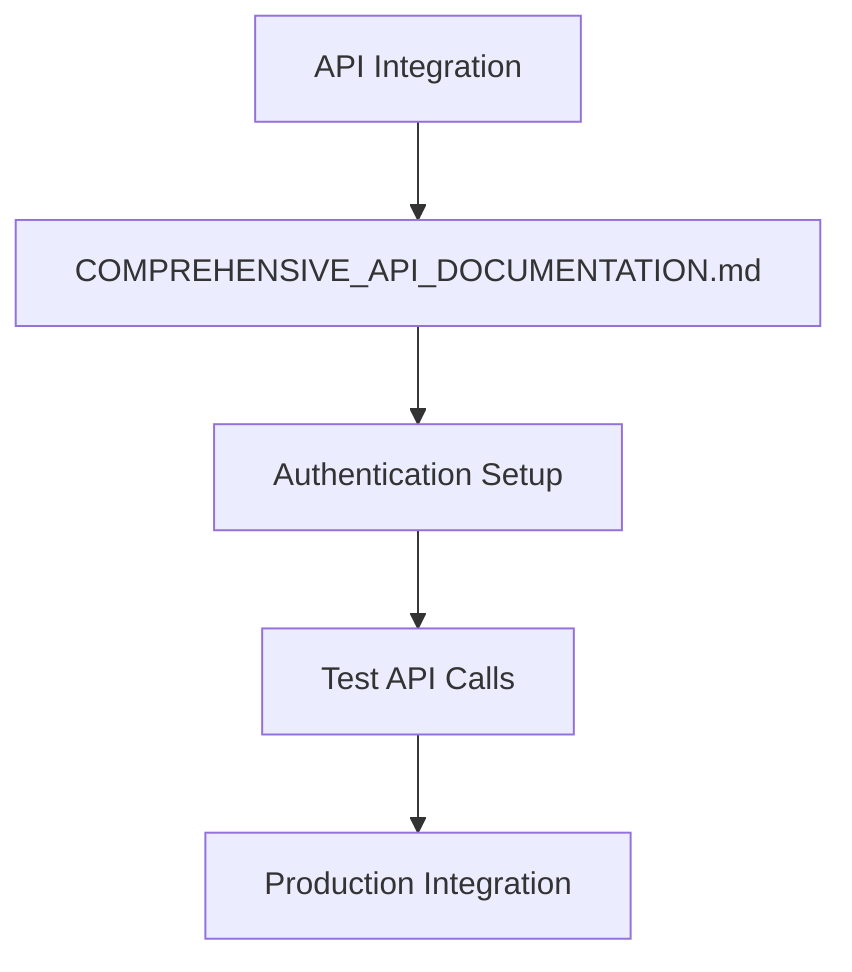
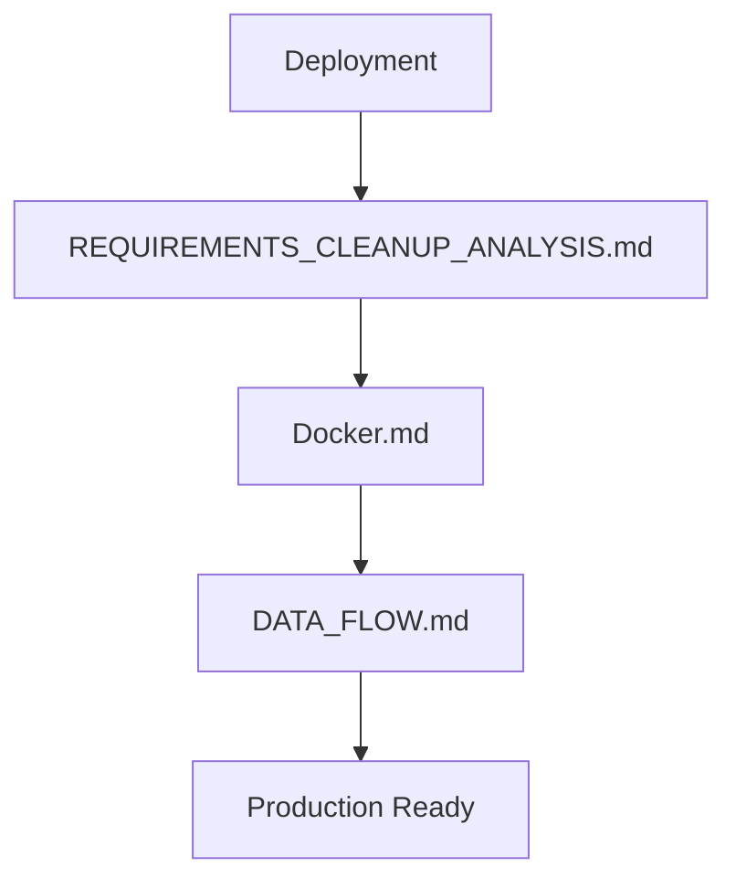

# RAG Platform Documentation

**Professional documentation for the Enterprise RAG Platform with PostgreSQL + Qdrant hybrid architecture.**

## 🚀 Quick Start

### New to the Platform?
1. **[Architecture Overview](Architecture.md)** - Complete system architecture and design
2. **[Demo Setup](DEMO_TENANT_SETUP.md)** - Get started with demo environment
3. **[API Reference](COMPREHENSIVE_API_DOCUMENTATION.md)** - Complete API documentation
4. **[Testing Guide](../tests/README.md)** - Run tests and validate functionality

### Ready to Deploy?
1. **[Docker Deployment](Docker.md)** - Container deployment guide
2. **[System Requirements](REQUIREMENTS_CLEANUP_ANALYSIS.md)** - Dependencies and setup
3. **[Data Flow](DATA_FLOW.md)** - Understanding system interactions

## 📚 Documentation Categories

### 🏗️ **System Architecture**
- **[Architecture.md](Architecture.md)** ⭐ **PRIMARY REFERENCE**
  - Complete hybrid PostgreSQL + Qdrant architecture
  - Critical implementation details and debugging findings
  - Performance metrics and GPU acceleration (RTX 5070)
  - Vector search optimization and similarity thresholds

### 🔌 **API Documentation**
- **[COMPREHENSIVE_API_DOCUMENTATION.md](COMPREHENSIVE_API_DOCUMENTATION.md)** ⭐ **API REFERENCE**
  - All endpoints with request/response formats
  - Authentication and security details
  - Complete usage examples
  - Implementation status tracking

### 🚀 **Deployment & Operations**
- **[Docker.md](Docker.md)** - Container orchestration and deployment
- **[DEMO_TENANT_SETUP.md](DEMO_TENANT_SETUP.md)** - Demo environment setup
- **[DATA_FLOW.md](DATA_FLOW.md)** - System data flow and tenant isolation

### 🔧 **Development & Maintenance**
- **[../tests/README.md](../tests/README.md)** - Comprehensive testing guide
- **[REQUIREMENTS_CLEANUP_ANALYSIS.md](REQUIREMENTS_CLEANUP_ANALYSIS.md)** - Dependency management
- **[../scripts/README.md](../scripts/README.md)** - Development scripts and utilities

### 📦 **Archive**
Historical documents and completed implementation plans:
- **[archive/](archive/)** - Superseded planning documents and implementation notes

## 🎯 Documentation Status

### ✅ **Active Documents** (7 files)
| Document | Purpose | Status | Audience |
|----------|---------|--------|----------|
| **Architecture.md** | System design & implementation | ✅ Current | Developers, Architects |
| **COMPREHENSIVE_API_DOCUMENTATION.md** | Complete API reference | ✅ Current | Developers, Integrators |
| **Docker.md** | Deployment guide | ✅ Current | DevOps, Operations |
| **DEMO_TENANT_SETUP.md** | Demo environment | ✅ Current | Developers, QA |
| **DATA_FLOW.md** | System interactions | ✅ Current | Developers, Support |
| **REQUIREMENTS_CLEANUP_ANALYSIS.md** | Dependency management | ✅ Reference | Developers, DevOps |
| **README.md** (this file) | Documentation index | ✅ Current | All users |

### 📁 **Archived Documents** (5 files)
| Document | Reason | Date Archived |
|----------|--------|---------------|
| RAG_IMPLEMENTATION_PLAN.md | Implementation completed | 2025-01-29 |
| EMBEDDING_GENERATION_PLAN.md | Features implemented | 2025-01-29 |
| EMBEDDING_IMPLEMENTATION_NOTES.md | Integrated into Architecture.md | 2025-01-29 |
| QUERY_API_STATUS.md | Merged into API documentation | 2025-01-29 |
| SYNC_API_STATUS.md | Merged into API documentation | 2025-01-29 |

## 🗺️ Navigation Guide

### **For New Developers**

**Path:** Architecture → Demo Setup → Testing → Development

### **For API Integration**

**Path:** API Docs → Auth → Testing → Integration

### **For Deployment**

**Path:** Requirements → Docker Setup → Data Flow → Deploy

## 🔍 Finding Information

### **Common Questions & Answers**

**Q: How does the vector search work?**  
A: See [Architecture.md](Architecture.md) → "Vector Search & ID Mapping" section

**Q: What APIs are available?**  
A: See [COMPREHENSIVE_API_DOCUMENTATION.md](COMPREHENSIVE_API_DOCUMENTATION.md) → "Endpoint Reference"

**Q: How do I set up a demo?**  
A: See [DEMO_TENANT_SETUP.md](DEMO_TENANT_SETUP.md) → "Quick Setup" section

**Q: How do I run tests?**  
A: See [../tests/README.md](../tests/README.md) → "Quick Start" section

**Q: How do I deploy with Docker?**  
A: See [Docker.md](Docker.md) → "Deployment Guide" section

**Q: Why is my query not finding results?**  
A: See [Architecture.md](Architecture.md) → "Debugging Vector Search" section

**Q: What are the system requirements?**  
A: See [REQUIREMENTS_CLEANUP_ANALYSIS.md](REQUIREMENTS_CLEANUP_ANALYSIS.md) → "Dependencies" section

## 📊 Architecture Summary

### **System Components**
- **PostgreSQL**: Metadata, relationships, tenant isolation
- **Qdrant**: Vector storage and similarity search  
- **Backend**: FastAPI application with RAG pipeline
- **Frontend**: React application with TypeScript

### **Key Features**
- ✅ **Multi-tenant architecture** with complete data isolation
- ✅ **Hybrid vector storage** (PostgreSQL + Qdrant)
- ✅ **Real-time document synchronization** with delta sync
- ✅ **GPU-accelerated embeddings** (RTX 5070 compatible)
- ✅ **Production-ready API** with comprehensive documentation
- ✅ **Containerized deployment** with Docker Compose

### **Performance Characteristics**
- **Vector Search**: Sub-second response times
- **End-to-End RAG**: 3.6s average response time
- **Embedding Generation**: 1.16s (CPU), 6.5x faster with GPU
- **Similarity Threshold**: 0.3 optimal for recall/precision balance

## 🔄 Maintenance

### **Regular Updates Required**
- **Architecture.md**: When system design changes
- **API Documentation**: When endpoints are added/modified  
- **Test Documentation**: When test procedures change

### **No Updates Required**
- **Demo Setup**: Stable process
- **Docker Configuration**: Mature setup
- **Data Flow**: Stable architecture

### **Archive When**
- Implementation plans are completed
- Features are fully integrated into main documentation
- Status tracking becomes obsolete

## 🎯 Contributing to Documentation

### **Documentation Standards**
1. **Clear Purpose**: Each document should have a single, clear purpose
2. **Current Information**: All content must reflect the current implementation
3. **Professional Quality**: Use consistent formatting and clear language
4. **Cross-References**: Link related information between documents
5. **Examples**: Include practical examples and usage scenarios

### **Adding New Documentation**
1. Determine if information fits in existing documents
2. Follow naming convention: descriptive, professional names
3. Add entry to this README.md index
4. Include clear purpose and audience in document header

### **Updating Existing Documentation**
1. Maintain accuracy with current implementation
2. Update cross-references when content moves
3. Archive obsolete sections rather than deleting
4. Test all examples and code snippets

---

## 📞 Support

For questions about the documentation:
- **Architecture**: Refer to Architecture.md comprehensive guide
- **API Issues**: Check COMPREHENSIVE_API_DOCUMENTATION.md
- **Setup Problems**: Follow DEMO_TENANT_SETUP.md troubleshooting
- **Test Failures**: Use ../tests/README.md debugging guide

**Documentation maintained by**: RAG Platform Development Team  
**Last major update**: 2025-01-29  
**Next review**: As needed for architecture changes